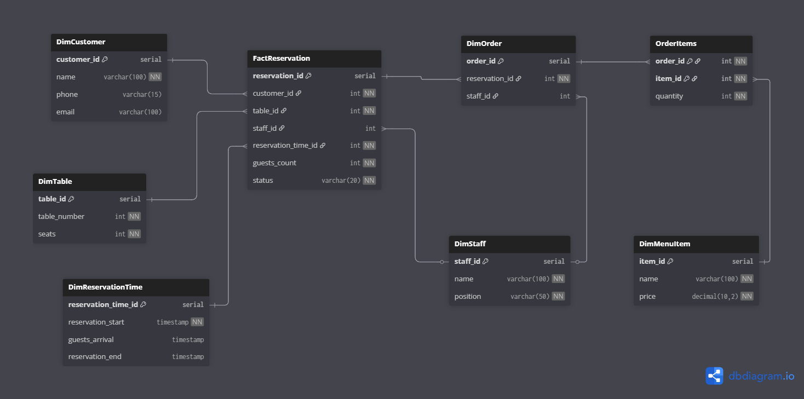

# Проектирование Data Warehouse для системы бронирования ресторана

---

## 1. Выбор и описание бизнес-процесса

**Бизнес-процесс:** бронирование столика в ресторане

---

## 2. Уровень детализации (grain) бизнес-процесса

**Уровень детализации:** каждое отдельное бронирование

---

## 3. Таблицы измерений (Dimension Tables)

- **DimCustomer** — информация о клиенте (ID, имя, телефон, email)  
- **DimTable** — информация о столе (ID, номер стола, количество посадочных мест)  
- **DimStaff** — информация о сотруднике (ID, имя, должность)  
- **DimMenuItem** — пункты меню (ID, название, цена, количество)  
- **DimReservationTime** — детали времени:  
  - время начала бронирования  
  - время фактического прихода гостей  
  - время окончания бронирования  

---

## 4. Таблица фактов (FactReservation) — структура

Каждая запись в FactReservation отражает одно индивидуальное бронирование столика в ресторане. Она связывает основные бизнес-измерения и содержит ключевые метрики.

| Атрибут             | Описание                                                                                  |
|---------------------|-------------------------------------------------------------------------------------------|
| reservation_id      | Уникальный идентификатор бронирования (первичный ключ)                                    |
| customer_id         | Ссылка на DimCustomer — клиент, который сделал бронирование                               |
| table_id            | Ссылка на DimTable — забронированный стол                                                |
| staff_id            | Ссылка на DimStaff — сотрудник, который принял бронирование                              |
| reservation_time_id | Ссылка на DimReservationTime — содержит время начала бронирования, фактическое время прихода гостей и время окончания |
| guests_count        | Количество гостей по бронированию                                                        |
| status              | Статус бронирования (подтверждено, отменено, выполнено и пр.)                            |

---

## Дополнительные таблицы измерений

- **DimReservationTime** — измерение с тремя временными точками:  
  - `reservation_start` — запланированное время начала бронирования  
  - `guests_arrival` — фактическое время прихода гостей (может быть пустым, если посетитель не пришёл)  
  - `reservation_end` — время окончания бронирования (освобождения стола)  

- **DimOrder** — измерение заказов  
  - каждая запись представляет один заказ, связанный с бронированием  
  - связан с сотрудником, обслуживающим заказ  
  - дата и время заказа в этой таблице не хранятся (при необходимости можно будет добавить)  

- **OrderItems** — состав заказа  
  - связующая таблица many-to-many для заказов и пунктов меню  
  - содержит количество каждого пункта меню в заказе  

---

## Обоснование

- Таблица фактов сосредоточена именно на бронировании как главном бизнес-событии.  
- Время бронирования разбито на три компонента в отдельной таблице для аналитики временных характеристик.  
- Заказы и их состав вынесены в отдельные измерения, что облегчает анализ детализации заказов без избыточности в таблице фактов бронирования.  
- Структура обеспечивает баланс между нормализацией и простотой аналитики, облегчая построение отчетов по бронированиям, времени, клиентам, заказам и меню.  

---

## 5. Схема (Snowflake Schema)

### SQL-код для создания таблиц

```
sql
-- Таблицы измерений

CREATE TABLE DimCustomer (
customer_id SERIAL PRIMARY KEY,
name VARCHAR(100) NOT NULL,
phone VARCHAR(15),
email VARCHAR(100) UNIQUE
);

CREATE TABLE DimTable (
table_id SERIAL PRIMARY KEY,
table_number INTEGER UNIQUE NOT NULL,
seats INTEGER CHECK (seats > 0)
);

CREATE TABLE DimStaff (
staff_id SERIAL PRIMARY KEY,
name VARCHAR(100) NOT NULL,
position VARCHAR(50) NOT NULL
);

CREATE TABLE DimMenuItem (
item_id SERIAL PRIMARY KEY,
name VARCHAR(100) NOT NULL,
price NUMERIC(10,2) NOT NULL CHECK (price > 0)
);

CREATE TABLE DimReservationTime (
reservation_time_id SERIAL PRIMARY KEY,
reservation_start TIMESTAMP NOT NULL,
guests_arrival TIMESTAMP,
reservation_end TIMESTAMP
);

-- Факты бронирований

CREATE TABLE FactReservation (
reservation_id SERIAL PRIMARY KEY,
customer_id INTEGER NOT NULL REFERENCES DimCustomer(customer_id),
table_id INTEGER NOT NULL REFERENCES DimTable(table_id),
staff_id INTEGER REFERENCES DimStaff(staff_id),
reservation_time_id INTEGER NOT NULL REFERENCES DimReservationTime(reservation_time_id),
guests_count INTEGER NOT NULL CHECK (guests_count > 0),
status VARCHAR(20) NOT NULL
);

-- Измерения заказов

CREATE TABLE DimOrder (
order_id SERIAL PRIMARY KEY,
reservation_id INTEGER NOT NULL REFERENCES FactReservation(reservation_id),
staff_id INTEGER REFERENCES DimStaff(staff_id)
);

-- Связующая таблица для состава заказов

CREATE TABLE OrderItems (
order_id INTEGER NOT NULL REFERENCES DimOrder(order_id),
item_id INTEGER NOT NULL REFERENCES DimMenuItem(item_id),
quantity INTEGER NOT NULL CHECK (quantity > 0),
PRIMARY KEY (order_id, item_id)
);
```

### DBML код для схемы
```
DBML
Table DimCustomer {
customer_id serial [pk]
name varchar(100) [not null]
phone varchar(15)
email varchar(100) [unique]
}

Table DimTable {
table_id serial [pk]
table_number int [not null, unique]
seats int [not null, note: "CHECK (seats > 0)"]
}

Table DimStaff {
staff_id serial [pk]
name varchar(100) [not null]
position varchar(50) [not null]
}

Table DimMenuItem {
item_id serial [pk]
name varchar(100) [not null]
price decimal(10,2) [not null, note: "CHECK (price > 0)"]
}

Table DimReservationTime {
reservation_time_id serial [pk]
reservation_start timestamp [not null]
guests_arrival timestamp
reservation_end timestamp
}

Table FactReservation {
reservation_id serial [pk]
customer_id int [not null, ref: > DimCustomer.customer_id]
table_id int [not null, ref: > DimTable.table_id]
staff_id int [ref: > DimStaff.staff_id]
reservation_time_id int [not null, ref: > DimReservationTime.reservation_time_id]
guests_count int [not null, note: "CHECK (guests_count > 0)"]
status varchar(20) [not null]
}

Table DimOrder {
order_id serial [pk]
reservation_id int [not null, ref: > FactReservation.reservation_id]
staff_id int [ref: > DimStaff.staff_id]
}

Table OrderItems {
order_id int [not null, ref: > DimOrder.order_id]
item_id int [not null, ref: > DimMenuItem.item_id]
quantity int [not null, note: "CHECK (quantity > 0)"]
indexes {
(order_id, item_id) [pk]
}
}
```

## ER-Диаграмма




## 6. Аналитические запросы

### 1. Количество бронирований и гостей по датам

```
SELECT 
    rt.reservation_start::date AS date,
    COUNT(fr.reservation_id) AS total_reservations,
    SUM(fr.guests_count) AS total_guests
FROM FactReservation fr
JOIN DimReservationTime rt ON fr.reservation_time_id = rt.reservation_time_id
GROUP BY date
ORDER BY date;
```


**Почему важно:** Позволяет отслеживать динамику бронирований и загруженность ресторана по дням. Помогает планировать ресурсы, персонал, закупки и акции.

---

### 2. Процент опозданий и неявок клиентов
```
SELECT 
    COUNT(*) FILTER (WHERE rt.guests_arrival > rt.reservation_start) * 100.0 / COUNT(*) AS late_arrival_percent,
    COUNT(*) FILTER (WHERE rt.guests_arrival IS NULL) * 100.0 / COUNT(*) AS no_show_percent
FROM FactReservation fr
JOIN DimReservationTime rt ON fr.reservation_time_id = rt.reservation_time_id;
```

**Почему важно:** Опоздания и неявки снижают эффективность использования столов и доходы. Метрика помогает оптимизировать политику бронирований и коммуникацию с клиентами.

---

### 3. Средняя продолжительность бронирования по столам


```
SELECT 
    t.table_number,
    AVG(EXTRACT(EPOCH FROM (rt.reservation_end - rt.reservation_start)) / 60) AS avg_duration_minutes
FROM FactReservation fr
JOIN DimReservationTime rt ON fr.reservation_time_id = rt.reservation_time_id
JOIN DimTable t ON fr.table_id = t.table_id
GROUP BY t.table_number
ORDER BY avg_duration_minutes DESC;
```


**Почему важно:** Позволяет понять, какие столы используются дольше, что влияет на скорость оборота и планирование.

---

### 4. Выручка по сотрудникам (обслуживающим заказы)


```
SELECT 
    s.name,
    SUM(oi.quantity * mi.price) AS total_revenue
FROM DimOrder o
JOIN OrderItems oi ON o.order_id = oi.order_id
JOIN DimMenuItem mi ON oi.item_id = mi.item_id
JOIN DimStaff s ON o.staff_id = s.staff_id
GROUP BY s.name
ORDER BY total_revenue DESC;
```
**Почему важно:** Оценка эффективности и вклада каждого сотрудника помогает стимулировать персонал и принимать кадровые решения.

---

### 5. Топ 10 популярных пунктов меню по количеству заказов

```
SELECT 
    mi.name,
    SUM(oi.quantity) AS total_ordered
FROM OrderItems oi
JOIN DimMenuItem mi ON oi.item_id = mi.item_id
GROUP BY mi.name
ORDER BY total_ordered DESC
LIMIT 10;
```