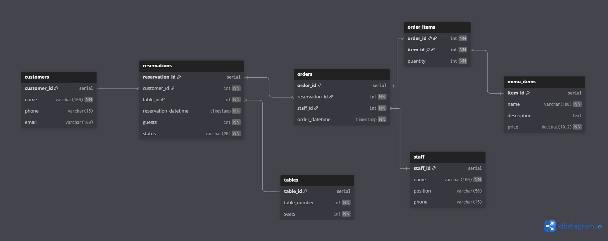

# Part 1: Выбор Сценария

Для данной работы выбран сценарий: **Система бронирования в ресторане** — управление бронированиями клиентов, столиками, персоналом и пунктами меню.

---

# Part 2: Проектирование Базы Данных и Документация

## Идентификация Сущностей и Атрибутов

- **Клиенты (customers):** id клиента, имя, телефон, email  
- **Столы (tables):** id стола, номер стола, количество посадочных мест  
- **Персонал (staff):** id сотрудника, имя, должность, телефон  
- **Пункты меню (menu_items):** id пункта меню, название, описание, цена  
- **Бронирования (reservations):** id брони, id клиента, id стола, дата и время, количество гостей, статус  
- **Заказы (orders):** id заказа, id брони, id сотрудника, дата и время заказа  
- **Заказанные позиции (order_items):** связь многие-ко-многим заказов и пунктов меню, количество  

---

## Проектирование Таблиц

### Table Name: `customers`  
- **Description:** Хранит данные о клиентах ресторана  
- **Attributes:**  
  - `customer_id`: SERIAL, PK, NOT NULL, UNIQUE  
  - `name`: VARCHAR(100), NOT NULL  
  - `phone`: VARCHAR(15)  
  - `email`: VARCHAR(100), UNIQUE  
- **Constraints:**  
  - PK_customers: PRIMARY KEY (`customer_id`)  
  - UQ_email: UNIQUE (`email`)  

---

### Table Name: `tables`  
- **Description:** Содержит информацию о столах ресторана  
- **Attributes:**  
  - `table_id`: SERIAL, PK, NOT NULL, UNIQUE  
  - `table_number`: INTEGER, NOT NULL, UNIQUE  
  - `seats`: INTEGER, NOT NULL  
- **Constraints:**  
  - PK_tables: PRIMARY KEY (`table_id`)  
  - CHK_seats_positive: CHECK (`seats` > 0)  
  - UQ_table_number: UNIQUE (`table_number`)  

---

### Table Name: `staff`  
- **Description:** Информация о сотрудниках ресторана  
- **Attributes:**  
  - `staff_id`: SERIAL, PK, NOT NULL, UNIQUE  
  - `name`: VARCHAR(100), NOT NULL  
  - `position`: VARCHAR(50)  
  - `phone`: VARCHAR(15), UNIQUE  
- **Constraints:**  
  - PK_staff: PRIMARY KEY (`staff_id`)  
  - UQ_phone: UNIQUE (`phone`)  

---

### Table Name: `menu_items`  
- **Description:** Пункты меню ресторана  
- **Attributes:**  
  - `item_id`: SERIAL, PK, NOT NULL, UNIQUE  
  - `name`: VARCHAR(100), NOT NULL  
  - `description`: TEXT  
  - `price`: NUMERIC(10,2), NOT NULL  
- **Constraints:**  
  - PK_menu_items: PRIMARY KEY (`item_id`)  
  - CHK_price_positive: CHECK (`price` > 0)  

---

### Table Name: `reservations`  
- **Description:** Информация о бронированиях клиентов  
- **Attributes:**  
  - `reservation_id`: SERIAL, PK, NOT NULL, UNIQUE  
  - `customer_id`: INTEGER, FK REFERENCES `customers`(`customer_id`), NOT NULL  
  - `table_id`: INTEGER, FK REFERENCES `tables`(`table_id`), NOT NULL  
  - `reservation_datetime`: TIMESTAMP, NOT NULL  
  - `guests`: INTEGER, NOT NULL  
  - `status`: VARCHAR(20), NOT NULL  
- **Constraints:**  
  - PK_reservations: PRIMARY KEY (`reservation_id`)  
  - FK_reservations_customers: FOREIGN KEY (`customer_id`) REFERENCES `customers`(`customer_id`)  
  - FK_reservations_tables: FOREIGN KEY (`table_id`) REFERENCES `tables`(`table_id`)  
  - CHK_guests_positive: CHECK (`guests` > 0)  

---

### Table Name: `orders`  
- **Description:** Заказы, связанные с бронированиями  
- **Attributes:**  
  - `order_id`: SERIAL, PK, NOT NULL, UNIQUE  
  - `reservation_id`: INTEGER, FK REFERENCES `reservations`(`reservation_id`), NOT NULL  
  - `staff_id`: INTEGER, FK REFERENCES `staff`(`staff_id`), NOT NULL  
  - `order_datetime`: TIMESTAMP, NOT NULL, DEFAULT CURRENT_TIMESTAMP  
- **Constraints:**  
  - PK_orders: PRIMARY KEY (`order_id`)  
  - FK_orders_reservations: FOREIGN KEY (`reservation_id`) REFERENCES `reservations`(`reservation_id`)  
  - FK_orders_staff: FOREIGN KEY (`staff_id`) REFERENCES `staff`(`staff_id`)  

---

### Table Name: `order_items`  
- **Description:** Связующая таблица для реализации связи многие-ко-многим между заказами и пунктами меню  
- **Attributes:**  
  - `order_id`: INTEGER, FK REFERENCES `orders`(`order_id`), NOT NULL  
  - `item_id`: INTEGER, FK REFERENCES `menu_items`(`item_id`), NOT NULL  
  - `quantity`: INTEGER, NOT NULL  
- **Constraints:**  
  - PK_order_items: PRIMARY KEY (`order_id`, `item_id`)  
  - FK_order_items_orders: FOREIGN KEY (`order_id`) REFERENCES `orders`(`order_id`)  
  - FK_order_items_menu_items: FOREIGN KEY (`item_id`) REFERENCES `menu_items`(`item_id`)  
  - CHK_quantity_positive: CHECK (`quantity` > 0)  

---

## Взаимосвязи

- **customers — reservations (Один-ко-Многим):** Один клиент может иметь множество бронирований.  
  - Внешний ключ `reservations.customer_id` ссылается на `customers.customer_id`  

- **tables — reservations (Один-ко-Многим):** Один стол может иметь много бронирований в разное время.  
  - Внешний ключ `reservations.table_id` ссылается на `tables.table_id`  

- **reservations — orders (Один-ко-Многим):** Одно бронирование может сопровождаться одним или несколькими заказами.  
  - Внешний ключ `orders.reservation_id` ссылается на `reservations.reservation_id`  

- **staff — orders (Один-ко-Многим):** Один сотрудник может обслуживать много заказов.  
  - Внешний ключ `orders.staff_id` ссылается на `staff.staff_id`  

- **orders — menu_items (Многие-ко-Многим):** Заказы могут содержать несколько пунктов меню и пункты меню могут входить в различные заказы.  
  - Реализована через таблицу `order_items` с внешними ключами к `orders` и `menu_items`  

---

# Part 3: ER-Диаграмма и DBML

## DBML Код
```````
Table customers {
  customer_id serial [pk]
  name varchar(100) [not null]
  phone varchar(15)
  email varchar(100) [unique]
}

Table tables {
  table_id serial [pk]
  table_number int [not null, unique]
  seats int [not null, note: "CHECK (seats > 0)"]
}

Table staff {
  staff_id serial [pk]
  name varchar(100) [not null]
  position varchar(50)
  phone varchar(15) [unique]
}

Table menu_items {
  item_id serial [pk]
  name varchar(100) [not null]
  description text
  price decimal(10,2) [not null, note: "CHECK (price > 0)"]
}

Table reservations {
  reservation_id serial [pk]
  customer_id int [not null, ref: > customers.customer_id]
  table_id int [not null, ref: > tables.table_id]
  reservation_datetime timestamp [not null]
  guests int [not null, note: "CHECK (guests > 0)"]
  status varchar(20) [not null]
}

Table orders {
  order_id serial [pk]
  reservation_id int [not null, ref: > reservations.reservation_id]
  staff_id int [not null, ref: > staff.staff_id]
  order_datetime timestamp [not null, default: `CURRENT_TIMESTAMP`]
}

Table order_items {
  order_id int [not null, ref: > orders.order_id]
  item_id int [not null, ref: > menu_items.item_id]
  quantity int [not null, note: "CHECK (quantity > 0)"]
  indexes {
    (order_id, item_id) [pk]
  }
}
```````

## ER-Диаграмма



---
