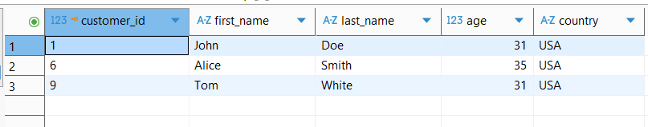
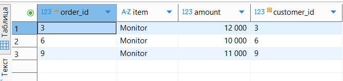

# SQL Practice Tasks

## Часть 1: WHERE

### Задача 1  
**Найдите всех клиентов из страны 'USA', которым больше 25 лет.**

```
SELECT 
    customer_id,
    first_name,
    last_name,
    age,
    country
FROM customers c
WHERE c.age > 25 AND c.country = 'USA';
```



***

### Задача 2  
**Выведите все заказы, у которых сумма (amount) больше 1000.**

```
SELECT 
    order_id,
    item,
    amount,
    customer_id
FROM orders o
WHERE o.amount > 1000;
```


***

## Часть 2: JOIN

### Задача 1  
**Получите список заказов вместе с именем клиента, который сделал заказ.**

```
SELECT 
    c.first_name,
    c.last_name,
    o.item,
    o.amount
FROM orders o
LEFT JOIN customers c ON o.customer_id = c.customer_id;
```


***

### Задача 2  
**Выведите список доставок со статусом и именем клиента.**

```
SELECT 
    s.status,
    c.first_name,
    c.last_name
FROM shippings s
LEFT JOIN customers c ON s.customer = c.customer_id;
```


***

## Часть 3: GROUP BY

### Задача 1  
**Подсчитайте количество клиентов в каждой стране.**

```
SELECT 
    c.country, 
    COUNT(*) AS clients_count
FROM customers c
GROUP BY c.country
ORDER BY clients_count DESC;
```


***

### Задача 2  
**Посчитайте общее количество заказов и среднюю сумму по каждому товару.**

```
SELECT 
    o.item, 
    COUNT(o.item) AS order_count, 
    ROUND(AVG(o.amount), 2) AS avg_amount
FROM orders o
GROUP BY o.item;
```


***

## Часть 4: ORDER BY

### Задача 1  
**Выведите список клиентов, отсортированный по возрасту по убыванию.**

```
SELECT 
    c.first_name,
    c.age
FROM customers c
ORDER BY c.age DESC;
```


***

## Часть 5: SUBQUERIES

### Задача 1  
**Найдите всех клиентов, которые сделали заказ с максимальной суммой.**

```
SELECT 
    c.first_name,
    c.last_name,
    o.amount
FROM customers c
JOIN orders o ON c.customer_id = o.customer_id
WHERE o.amount = (
    SELECT MAX(amount)
    FROM orders
);
```


***

## Часть 6: WINDOW FUNCTIONS

### Задача 1  
**Для каждого заказа добавьте колонку с суммой всех заказов этого клиента (используя оконную функцию).**

```
SELECT 
    o.order_id, 
    c.customer_id, 
    o.item, 
    o.amount, 
    SUM(o.amount) OVER (PARTITION BY o.customer_id) AS total_by_customer
FROM orders o
LEFT JOIN customers c ON c.customer_id = o.customer_id;
```


***

## Часть 7 (Опционально)

### Задача  
**Найдите клиентов, которые:  
1. Сделали хотя бы 2 заказа (любых),  
2. Имеют хотя бы одну доставку со статусом 'Delivered'.  

Для каждого такого клиента выведите:**

- full_name (имя + фамилия),
- общее количество заказов,
- общую сумму заказов,
- страну проживания.

```
SELECT 
    concat_ws(' ', c.first_name, c.last_name) AS full_name,
    c.country,
    COUNT(o.order_id) AS total_orders,
    SUM(o.amount) AS total_amount
FROM customers c
JOIN (
    SELECT DISTINCT customer
    FROM shippings
    WHERE status = 'Delivered'
) s_delivered ON s_delivered.customer = c.customer_id
JOIN orders o ON o.customer_id = c.customer_id
GROUP BY c.customer_id, c.first_name, c.last_name, c.country
HAVING COUNT(o.order_id) > 1;
```


***
